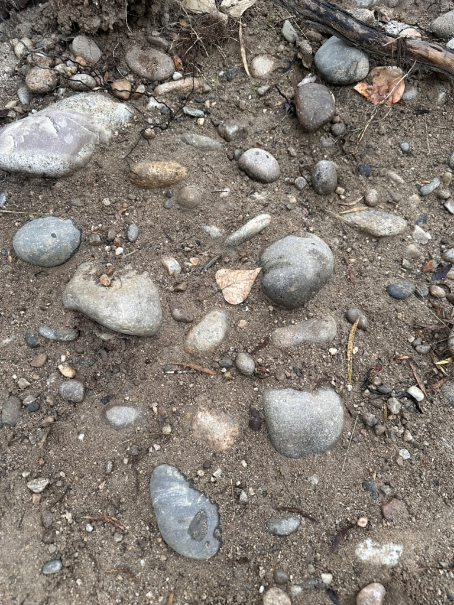

# Rock Image Analyzer - AI-Powered Geological Analysis

> ⚠️ **EXPERIMENTAL PROJECT** - This is an amateur hobby tool. Rock identifications are AI-generated and should not be considered authoritative geological assessments.

An amateur Python project that uses Google's Gemini 2.5 Pro AI model to identify and analyze rocks in images. This is an experimental tool developed as part of a wider hobby project, attempting to use established geological classification standards where possible.

## Features

- **Geological Classification Attempt**: Tries to apply standardized geological terminology (rock classes, Wentworth scale, weathering grades, etc.)
- **Location-Aware Analysis**: Optional location context to potentially improve identification accuracy
- **Comparison Mode**: Analyze with and without location to see the impact of contextual information
- **Structured JSON Output**: Discrete fields for programmatic parsing plus descriptive fields
- **Analysis Time**: ~60-80 seconds per image using Gemini 2.5 Pro with thinking mode
- **Two Analysis Modes**:
  - `rock_analyzer.py`: Detailed geological analysis attempting to use standard classifications
  - `quick_analyzer.py`: Faster simplified analysis with basic categorization

## Installation

### Prerequisites
- Python 3.8+
- Google Gemini API key ([Get one here](https://makersuite.google.com/app/apikey))

### Setup

1. Clone the repository:
```bash
git clone https://github.com/yourusername/rock-image-analyzer.git
cd rock-image-analyzer
```

2. Create a virtual environment:
```bash
python3 -m venv venv
source venv/bin/activate  # On Windows: venv\Scripts\activate
```

3. Install dependencies:
```bash
pip install -r requirements.txt
```

4. Configure API key:
```bash
cp .env.example .env
# Edit .env and add your Gemini API key
```

## Usage

### Comprehensive Geological Analysis

```bash
python rock_analyzer.py path/to/image.jpg

# With location context
python rock_analyzer.py rocks.jpg --location "Grand Canyon, Arizona"

# Save results to JSON
python rock_analyzer.py rocks.jpg --location "Utah" --save

# Compare with/without location
python rock_analyzer.py rocks.jpg --location "Yosemite" --compare
```

### Quick Analysis

```bash
python quick_analyzer.py path/to/image.jpg

# With location and comparison
python quick_analyzer.py rocks.jpg --location "Hawaii" --compare --save
```

## Output Format

### Rock Classification Fields

**Discrete Standardized Fields** (for programmatic parsing):
- `rock_class`: igneous_volcanic, sedimentary_clastic, metamorphic_foliated, etc.
- `size_class`: Wentworth scale (pebble, cobble, boulder, etc.)
- `grain_size`: cryptocrystalline to pegmatitic
- `weathering_grade`: fresh to residual_soil
- `hardness_class`: very_soft to very_hard (Mohs scale)
- `primary_structure`: massive, layered, vesicular, etc.
- `geological_context`: in_situ_outcrop, float, talus, etc.

**Flexible Descriptive Fields** (AI interpretation):
- `specific_rock_name`: Detailed rock identification
- `mineral_assemblage`: Visible minerals
- `texture_description`: Comprehensive texture analysis
- `field_notes`: AI-generated observations
- `likely_formation`: Geological formation if identifiable

### Sample Analysis Results

<details>
<summary><b>📊 Full Analysis With Location Context</b></summary>

**Input:** River rocks from banks of Boise River near Boise, Idaho
**Analysis time:** ~77 seconds

```json
{
  "summary": {
    "total_rocks": 6,
    "dominant_rock_class": "igneous_plutonic",
    "secondary_rock_class": "igneous_volcanic",
    "average_grain_size": "mixed",
    "weathering_assessment": "Slight to moderate weathering, dominated by mechanical abrasion (fluvial rounding) with minor chemical oxidation on some clasts.",
    "geological_setting": "Fluvial gravel bar or terrace deposit on the banks of the Boise River, within the western Snake River Plain.",
    "tectonic_interpretation": "The mixed rock assemblage reflects multiple tectonic events: Cretaceous subduction-related magmatism (Idaho Batholith) and Cenozoic extensional tectonics and hotspot-related volcanism (Snake River Plain).",
    "depositional_environment": "Moderate to high-energy fluvial environment, characterized by the transport and deposition of sand, pebbles, and cobbles.",
    "economic_geology_notes": "These types of fluvial deposits are a primary source of aggregate (sand and gravel). Historically, the Boise River basin has been a site for placer gold mining, with gold eroded from lode deposits within the Idaho Batholith.",
    "location_used": "banks of Boise River near Boise, Idaho"
  },
  "rocks": [
    {
      "rock_class": "igneous_plutonic",
      "specific_rock_name": "Granodiorite or Granite",
      "size_class": "cobble",
      "grain_size": "medium",
      "weathering_grade": "slight",
      "hardness_class": "hard",
      "primary_structure": "crystalline",
      "geological_context": "stream_cobble",
      "confidence_level": "high",
      "confidence_value": 0.75,
      "estimated_diameter_cm": 15.0,
      "mineral_assemblage": "Likely quartz (grayish), plagioclase/K-feldspar (white), and a mafic mineral like biotite or hornblende (black).",
      "field_notes": "This is a classic example of a granitoid clast derived from the Idaho Batholith. The phaneritic texture is diagnostic of a slow-cooling plutonic origin.",
      "likely_formation": "Idaho Batholith",
      "age_estimate": "Cretaceous"
    },
    {
      "rock_class": "igneous_volcanic",
      "specific_rock_name": "Basalt",
      "size_class": "pebble",
      "grain_size": "cryptocrystalline",
      "weathering_grade": "slight",
      "hardness_class": "hard",
      "primary_structure": "massive",
      "geological_context": "stream_cobble",
      "confidence_level": "high",
      "confidence_value": 0.7,
      "estimated_diameter_cm": 4.0,
      "field_notes": "This is a typical mafic volcanic clast, likely derived from the Snake River Plain Group basalts. Its high degree of rounding suggests it has traveled a considerable distance in the river.",
      "likely_formation": "Snake River Plain Group",
      "age_estimate": "Neogene (Miocene to Holocene)"
    }
  ]
}
```

**Key Findings:**
- Identified 6 specimens: granite/granodiorite from Idaho Batholith and basalt from Snake River Plain
- Multi-tectonic event history: Cretaceous subduction (plutonic rocks) + Cenozoic hotspot volcanism (volcanic rocks)
- Fluvial transport evident from well-rounded shapes
- Historical placer gold mining area
- This is an **experimental hobbyist analysis** - AI-generated identifications should not be considered authoritative

</details>

<details>
<summary><b>📊 Full Analysis Without Location Context - Utah Tufa Example</b></summary>

**Input:** Rock sample from Utah
**Analysis time:** ~68 seconds

```json
{
  "summary": {
    "total_rocks": 5,
    "dominant_rock_class": "sedimentary_chemical",
    "secondary_rock_class": "unconsolidated",
    "geological_setting": "The prevalence of tufa/travertine strongly suggests a localized depositional setting at a site of carbonate-rich groundwater discharge.",
    "tectonic_interpretation": "Travertine deposits can be associated with extensional tectonic settings where faulting provides conduits for deep, mineral-rich groundwater circulation.",
    "depositional_environment": "Terrestrial freshwater environment characterized by the precipitation of calcium carbonate from solution. This could be a cool-water spring (forming tufa) or a geothermal hot spring (forming travertine).",
    "economic_geology": "Travertine and tufa are quarried as ornamental and lightweight building stones. Such spring systems can also be indicators for geothermal energy potential."
  },
  "rocks": [
    {
      "rock_class": "sedimentary_chemical",
      "specific_rock_name": "Tufa",
      "size_class": "boulder",
      "size_cm": 45,
      "grain_size": "cryptocrystalline",
      "weathering_grade": "high",
      "weathering_type": "chemical",
      "hardness_class": "soft",
      "primary_structure": "vesicular",
      "geological_context": "displaced_block",
      "confidence_level": "high",
      "confidence_score": 0.85,
      "mineral_assemblage": "Primarily calcium carbonate (likely calcite).",
      "field_notes": "This appears to be a large piece of tufa, a freshwater carbonate deposit. The porous structure suggests rapid CO2 degassing and/or encrustation of plants.",
      "likely_formation": "Precipitated from cool, calcium-rich spring water, possibly encrusting plants or algae which have since decayed."
    }
  ]
}
```

**Key Findings:**
- Identified as tufa (freshwater carbonate deposits) based on vesicular texture
- Spring system deposit with rapid CO2 degassing
- High porosity from encrusted organic matter that decayed
- This is an **experimental hobbyist analysis** - AI-generated identifications should not be considered authoritative

</details>

### Comparison Mode Results

The `--compare` flag analyzes the same image both with and without location context to show how geographical information influences AI identification. This is useful for understanding potential biases in the experimental model.

<details>
<summary><b>🔄 Example: Comparison Analysis Impact</b></summary>

When analyzing the same rock sample with and without location context, the results can vary significantly:

#### With Location Context:
- AI may bias toward regionally common rock types
- Incorporates known geological formations from the area
- Higher confidence in tectonic and depositional interpretations
- May overlook contradictory visual features

#### Without Location Context:
- Relies purely on visual texture and mineralogy
- More objective feature-based identification
- Lower confidence in formation names and ages
- May miss regional geological context

**Example Impact:**
In one test with Utah tufa deposits, location context caused the AI to identify them as limestone (common in the region) despite distinctive tufa characteristics visible in the image. Without location, it correctly identified the vesicular texture as tufa from a spring system.

**Note:** This experimental hobbyist tool's identifications can be influenced by location biases and should not be considered authoritative.

</details>

### Example Command-Line Output

<details>
<summary><b>💻 Terminal Output Example</b></summary>

```bash
$ python rock_analyzer.py ABAB3BF2-B388-419F-8646-298FB9881E9C_1_105_c.jpeg \
    --location "banks of Boise River near Boise, Idaho" --save

Loading image: /Users/.../ABAB3BF2-B388-419F-8646-298FB9881E9C_1_105_c.jpeg
Performing geological analysis with location context...
Analysis completed in 76.57 seconds

======================================================================
GEOLOGICAL ANALYSIS REPORT
======================================================================

EXECUTIVE SUMMARY:
  Total specimens: 6
  Dominant lithology: igneous_plutonic
  Secondary lithology: igneous_volcanic
  Average grain size: mixed
  Weathering assessment: Slight to moderate weathering, dominated by
    mechanical abrasion (fluvial rounding) with minor chemical oxidation
  Location: banks of Boise River near Boise, Idaho

GEOLOGICAL INTERPRETATION:
  Setting: Fluvial gravel bar or terrace deposit on the banks of the
    Boise River, within the western Snake River Plain.
  Tectonic context: The mixed rock assemblage reflects multiple tectonic
    events: Cretaceous subduction-related magmatism (Idaho Batholith) and
    Cenozoic extensional tectonics and hotspot-related volcanism (Snake
    River Plain).

ECONOMIC GEOLOGY: These types of fluvial deposits are a primary source
  of aggregate. Historically, the Boise River basin has been a site for
  placer gold mining, with gold eroded from lode deposits within the
  Idaho Batholith.

======================================================================
DETAILED SPECIMEN DESCRIPTIONS (6 specimens)
======================================================================

--- Specimen 1 ---
Classification: igneous_plutonic
Specific name: Granodiorite or Granite
Size: cobble (~15 cm)
Grain size: medium
Confidence: high (0.75)
Formation: Idaho Batholith
Age: Cretaceous

[... additional specimens ...]

Results saved to: geological_analysis_ABAB3BF2-B388-419F-8646-298FB9881E9C_1_105_c.json
```

**Note:** This is an experimental hobbyist tool. Rock identifications are AI-generated and should not be considered authoritative geological assessments.

</details>

## Geological Features Detected

- **Rock Types**: All major rock classes and subtypes
- **Weathering Features**: Tafoni, spheroidal weathering, karst features
- **Structures**: Bedding, foliation, joints, veins
- **Textures**: Grain size, crystallinity, porosity
- **Alteration**: Oxidation, silicification, mineralization
- **Context**: Outcrop vs float, depositional environment

## Performance

- **Response Time**: 20-40 seconds per analysis
- **Image Size**: Automatically resized for optimal processing
- **Accuracy**: Enhanced significantly with location context

## Command Line Options

```
--location, -l    : Add location information (GPS, place name, region)
--compare, -c     : Compare results with and without location
--save, -s        : Save results to JSON file
--no-location     : Force analysis without location context
```

## API Requirements

- Google Gemini API key with access to Gemini 2.5 Pro model
- Internet connection for API calls

## Example Analysis: Boise River Rocks

The repository includes a sample image of river rocks from the banks of the Boise River near Boise, Idaho. This **experimental hobbyist analysis** demonstrates how the AI model identifies multiple rock types from different geological eras:

**Command used:**
```bash
python rock_analyzer.py ABAB3BF2-B388-419F-8646-298FB9881E9C_1_105_c.jpeg \
  --location "banks of Boise River near Boise, Idaho" --save
```

**Results:** The AI identified 6 specimens including:
- **Granite/Granodiorite cobbles** from the Cretaceous Idaho Batholith (~100 million years old)
- **Basalt pebbles** from the Neogene Snake River Plain Group (hotspot volcanism)
- Mixed assemblage showing multi-tectonic event history

The analysis correctly interpreted the fluvial depositional environment and even noted the historical placer gold mining significance of the area.


*Fluvial deposits on the banks of Boise River, Idaho - showing granite from Idaho Batholith and basalt from Snake River Plain*

## Technical Details

- Uses Google's `google-genai` Python SDK
- Implements typed schemas for guaranteed JSON structure
- Literal types for discrete categorization
- PIL/Pillow for image processing
- Gemini 2.5 Pro with thinking mode (32k budget) for deeper analysis

## Contributing

Contributions are welcome! Please feel free to submit pull requests or open issues for bugs and feature requests.

## License

MIT License - See LICENSE file for details

## Disclaimer

This is an amateur hobby project for educational and experimental purposes. The geological identifications are AI-generated and should not be considered authoritative or professional geological assessments. Always consult qualified geologists for professional rock and mineral identification.

## Acknowledgments

- Google Gemini AI for the vision model
- Geological classification standards from USGS and geological societies (attempted implementation)
- Wentworth scale for grain size classification